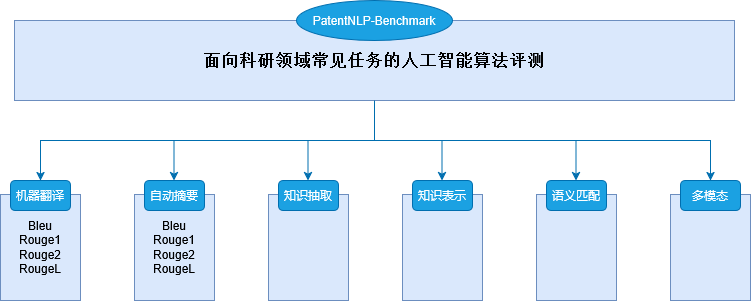
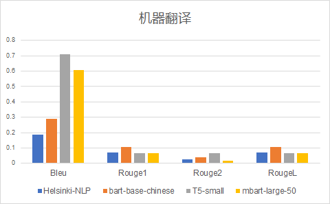
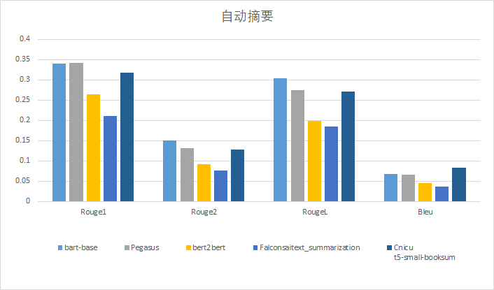

# PatentNLP-Benchmark 
面向科研领域常见任务的人工智能算法评测PatentNLP-Benchmark  
  
**不同任务的评测指标**  

**机器翻译评测结果对比**
|                   | Bleu  | Rouge1 | Rouge2 | RougeL |
|-------------------|-------|--------|--------|--------|
| Helsinki-NLP      | 0.185 | 0.07   | 0.0242 | 0.0695 |
| Bart-Base-Chinese | 0.29  | 0.106  | 0.039  | 0.105  |
| T5-small          | 0.708 | 0.066  | 0.020  | 0.0656 |
| Mbart-Large50     | 0.608 | 0.065  | 0.019  | 0.0647 |
|nllb-200-distilled-600M|0.107|0.084 |0.029   |0.084   | 
  
  **对比图**

**自动摘要评测结果对比**
|                              | Bleu  | Rouge1 | Rouge2 | RougeL |
|------------------------------|-------|--------|--------|--------|
| Bart-Base                    | 0.068 | 0.34   | 0.15   | 0.304  |
| Pegasus                      | 0.065 | 0.342  | 0.132  | 0.275  |
| Bert2Bert                    | 0.046 | 0.264  | 0.092  | 0.199  |
| Falconsai Text Summarization | 0.036 | 0.21   | 0.077  | 0.184  |
| T5-Small-Booksum             | 0.083 | 0.318  | 0.128  | 0.271  |
  
**对比图**
  
  
**知识表示评测结果对比**  
|         | Hit10 | Hit50 | Hit100 | MRR   |
|---------|-------|-------|--------|-------|
| Complex | 0.138 | 0.139 | 0.138  | 0.138 |
| HAKE    | 0.225 | 0.284 | 0.321  | 0.186 |
| RotatE  | 0.140 | 0.148 | 0.158  | 0.139 |
| TransE  | 0.138 | 0.139 | 0.139  | 0.138 |